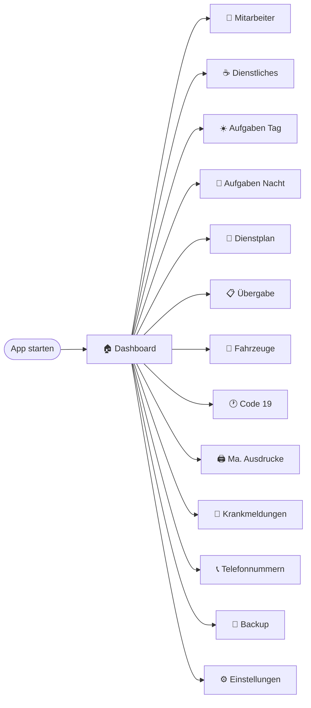
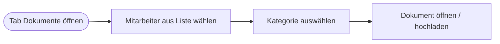
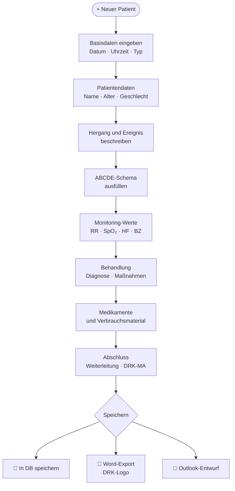
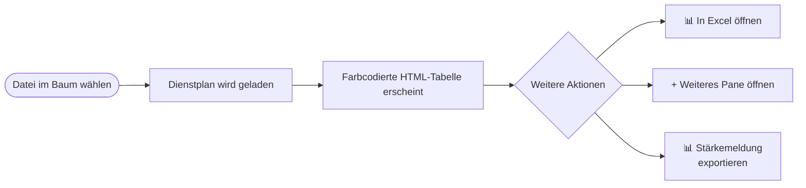
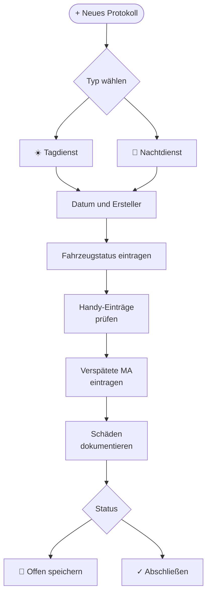
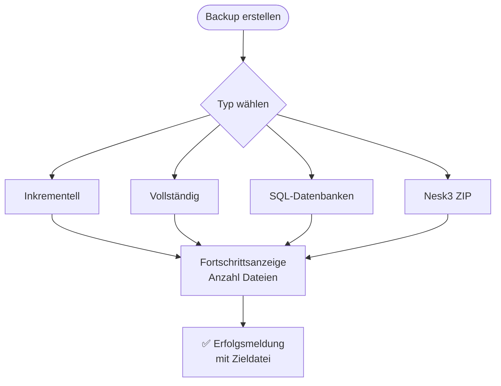
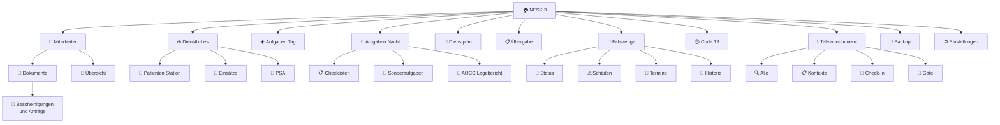

# NESK 3 – Benutzeranleitung
## DRK Erste-Hilfe-Station Flughafen Köln/Bonn
**Version 3.4.0 · Stand: März 2026**

---

> Diese Anleitung beschreibt alle Funktionen der Anwendung **NESK 3** und richtet sich an das Personal der DRK Erste-Hilfe-Station am Flughafen Köln/Bonn.

---

## Inhaltsverzeichnis

1. [Einführung und Übersicht](#1-einführung-und-übersicht)
2. [App starten und Benutzeroberfläche](#2-app-starten-und-benutzeroberfläche)
3. [🏠 Dashboard](#3--dashboard)
4. [👥 Mitarbeiter](#4--mitarbeiter)
5. [☕ Dienstliches](#5--dienstliches)
6. [☀️ Aufgaben Tagdienst](#6--aufgaben-tagdienst)
7. [🌙 Aufgaben Nachtdienst](#7--aufgaben-nachtdienst)
8. [📅 Dienstplan](#8--dienstplan)
9. [📋 Übergabe](#9--übergabe)
10. [🚗 Fahrzeuge](#10--fahrzeuge)
11. [🕐 Code 19](#11--code-19)
12. [🖨️ Mitarbeiter-Ausdrucke](#12-️-mitarbeiter-ausdrucke)
13. [🤒 Krankmeldungen](#13--krankmeldungen)
14. [📞 Telefonnummern](#14--telefonnummern)
15. [💾 Backup](#15--backup)
16. [⚙️ Einstellungen](#16-️-einstellungen)
17. [Tipps & Häufige Fragen](#17-tipps--häufige-fragen)

---

## 1. Einführung und Übersicht

**NESK 3** (Netzbasiertes Einsatz- und Schicht-Koordinationssystem) ist die interne Verwaltungssoftware der DRK Erste-Hilfe-Station am Flughafen Köln/Bonn. Die Anwendung fasst alle relevanten Bereiche des Dienstbetriebs in einer übersichtlichen Benutzeroberfläche zusammen.

### Was kann NESK 3?

| Bereich | Funktion |
|---------|----------|
| 👥 Personal | Mitarbeiterübersicht, Dokumente, Zuteilungen |
| 🏥 Dienstliches | Einsatzprotokolle (Patienten Station, ABCDE), Statistiken |
| ✅ Aufgaben | Tag- und Nachtdienst-Checklisten, Code-19-Mail, AOCC Lagebericht |
| 📅 Dienstplan | Excel-Dienstpläne laden, ansehen, Stärkemeldung exportieren |
| 📋 Übergabe | Schichtprotokoll erstellen, abschließen, per E-Mail übermitteln |
| 🚗 Fahrzeuge | Status, Schäden, TÜV/Wartungstermine verwalten |
| 📞 Telefon | Gate- und Check-In-Nummern, DRK-Kontakte |
| 💾 Sicherung | Automatisierte Backups erstellen und wiederherstellen |

### Technische Grundlage

- **Betriebssystem:** Windows 10/11
- **Programmiersprache:** Python 3.13
- **Oberfläche:** PySide6 (Qt-Framework)
- **Datenbanken:** SQLite (lokal)
- **E-Mail-Integration:** Microsoft Outlook (win32com)

---

## 2. App starten und Benutzeroberfläche

### App starten

**Option 1 – Direkt starten:**
```
Rechtsklick auf Desktop-Verknüpfung → Öffnen
```

**Option 2 – Über VS Code / Terminal:**
```powershell
python main.py
```

**Option 3 – PowerShell-Skript:**
```powershell
.\start_nesk.ps1
```

---

### Benutzeroberfläche im Überblick

```
┌─────────────────────────────────────────────────────────────────────────────┐
│                        NESK 3  –  DRK Flughafen KBN                         │
├───────────────────┬─────────────────────────────────────────────────────────┤
│                   │                                                          │
│  🏠 Dashboard     │                                                          │
│  👥 Mitarbeiter   │                                                          │
│  ☕ Dienstliches   │              Hauptbereich                               │
│  ☀️ Aufgaben Tag  │           (wechselt je nach                              │
│  🌙 Aufgaben Nacht│            gewähltem Menüpunkt)                          │
│  📅 Dienstplan    │                                                          │
│  📋 Übergabe      │                                                          │
│  🚗 Fahrzeuge     │                                                          │
│  🕐 Code 19       │                                                          │
│  🖨️ Ma. Ausdrucke │                                                          │
│  🤒 Krankmeldungen│                                                          │
│  📞 Telefonnummern│                                                          │
│  💾 Backup        │                                                          │
│  ⚙️ Einstellungen │                                                          │
│                   │                                                          │
└───────────────────┴─────────────────────────────────────────────────────────┘
```

### Navigationsleiste (links)

Die **linke Seitenleiste** enthält alle 14 Hauptbereiche der App. Durch einen Klick auf einen Menüpunkt wird der entsprechende Bereich im Hauptfenster geöffnet. Der aktive Punkt ist farblich hervorgehoben (DRK-Blau).

> **Tipp:** Bewegen Sie die Maus über einen Menüpunkt und halten Sie sie kurz inne – ein Tooltip erscheint mit einer Kurzbeschreibung der Funktion.

### Navigationspfad



---

## 3. 🏠 Dashboard

Das **Dashboard** ist die Startseite von NESK 3. Es erscheint automatisch beim Programmstart und gibt eine schnelle Übersicht über alle wichtigen Kennzahlen.

### Aufbau des Dashboards

```
┌──────────────────────────────────────────────────────────┐
│  🏠 Dashboard                                             │
├──────────────┬──────────────┬──────────────┬─────────────┤
│ 👥           │ 🚗           │ 📋           │ ✅          │
│ Mitarbeiter  │ Fahrzeuge    │ Protokolle   │ Aufgaben    │
│    42        │     5        │    128       │    8        │
├──────────────┴──────────────┴──────────────┴─────────────┤
│                                                           │
│   ✈  ──  ──  ──  ──  ──  ──  ──  ──  ──  ──  ──  ──→    │
│  ~~~~~~~~~~~~~~~~~~~~~~~~~~~~~~~~~~~~ Rollbahn ~~~~~~~~~~│
│                                                           │
│  [ Flugzeug-Kachel: CGN / FKB – Klicken für Infos ]      │
│                                                           │
└──────────────────────────────────────────────────────────┘
```

### Kacheln (StatCards)

Die vier farbigen Kacheln zeigen auf einen Blick:

| Kachel | Farbe | Inhalt |
|--------|-------|--------|
| 👥 Mitarbeiter | Blau | Anzahl erfasster Mitarbeiter in der Datenbank |
| 🚗 Fahrzeuge | Grün | Anzahl verwalteter Fahrzeuge |
| 📋 Protokolle | Orange | Anzahl erstellter Übergabeprotokolle |
| ✅ Aufgaben | Rot | Anzahl offener Aufgaben |

### Animierter Himmel

Unter den Statistik-Kacheln befindet sich ein animierter Bereich mit:
- Einem **beweglichen Flugzeug** (fährt von rechts nach links, mit Wolken)
- Einer **Rollbahn**-Darstellung am unteren Rand
- Einer **Flugzeug-Kachel** (klickbar), die allgemeine Standort-Informationen anzeigt

> **Hinweis:** Diese Anzeige ist rein informativ und dient der optischen Auflockerung.

---

## 4. 👥 Mitarbeiter

Der Bereich **Mitarbeiter** bildet das Herzstück der Personalverwaltung. Hier werden alle Mitarbeiter verwaltet und deren Dokumente hinterlegt.

### Aufbau

Der Bereich besteht aus **zwei Tabs**:

```
┌─────────────────────────────────────────────────────┐
│  👥 Mitarbeiter                                      │
│  ┌──────────────────┬──────────────────────────────┐│
│  │ 📄 Dokumente     │ 👥 Übersicht                 ││
│  └──────────────────┴──────────────────────────────┘│
│                                                     │
│  [ Inhalt je nach gewähltem Tab ]                   │
│                                                     │
└─────────────────────────────────────────────────────┘
```

---

### Tab: 👥 Übersicht

Zeigt alle Mitarbeiter in einer **paginierten Tabelle** (50 pro Seite).

#### Spalten der Tabelle

| Spalte | Inhalt |
|--------|--------|
| Name | Vor- und Nachname |
| Funktion | z. B. Rettungssanitäter, Teamleiter |
| Einsatzbereich | z. B. Tagdienst, Nachtdienst |
| Qualifikation | Ausbildungsstufe |
| Status | Aktiv / Inaktiv |

#### Aktionen

- **Mitarbeiter hinzufügen** – Klick auf `+ Hinzufügen`
- **Mitarbeiter bearbeiten** – Doppelklick auf einen Eintrag
- **Mitarbeiter löschen** – Eintrag auswählen → `Löschen`
- **Import aus Dienstplan** – Mitarbeiter direkt aus einer Excel-Dienstplandatei importieren
- **Seitennavigation** – `◀ Zurück` / `Weiter ▶` für Seitenblättern

---

### Tab: 📄 Dokumente (Mitarbeiterdokumente)

Hier werden alle Dokumente eines Mitarbeiters kategorisiert abgelegt und verwaltet.

#### Navigationsablauf



#### Kategorien

| Kategorie | Inhalt |
|-----------|--------|
| 📝 Stellungnahmen | Berichte zu Vorfällen und Verspätungen |
| 🪪 Bescheinigungen und Anträge | Ausweise, Tagesausweis-Anträge, offizielle Dokumente |
| 📋 Dienstanweisungen | Interne Dienstanweisungen und Verfügungen |
| 🦺 PSA | Persönliche Schutzausrüstung (Ausleihbelege etc.) |
| ⏱ Verspätung | Verspätungsdokumentationen |
| 📁 Sonstiges | Alle weiteren Dokumente |

---

### Kategorie: Bescheinigungen und Anträge – Tagesausweis

In dieser Kategorie gibt es einen **blauen Antrags-Panel** für den Flughafen-Tagesausweis:

```
┌───────────────────────────────────────────────────────────┐
│  🪪 Tagesausweis FKB – Antragsbereich                     │
│  ─────────────────────────────────────────────────────    │
│  [ 🌐 Ausweisportal öffnen ]  [ 📄 Antragsformular (PDF) ]│
│  [ 📧 E-Mail an Registration ]                            │
└───────────────────────────────────────────────────────────┘
```

| Schaltfläche | Funktion |
|-------------|----------|
| 🌐 **Ausweisportal öffnen** | Öffnet das FKB-Ausweisportal im Standard-Browser |
| 📄 **Antragsformular (PDF)** | Öffnet das gespeicherte PDF-Antragsformular direkt |
| 📧 **E-Mail an Registration** | Erstellt einen Outlook-Entwurf an die Ausweisregistrierung |

**E-Mail-Funktion – Ablauf:**
1. Klick auf `📧 E-Mail an Registration`
2. Dialog: Mitarbeitername eingeben
3. Optional: Anhang-Datei auswählen (z. B. ausgefülltes Antragsformular)
4. Outlook öffnet sich mit vorausgefülltem Entwurf inkl. Signatur

---

## 5. ☕ Dienstliches

Der Bereich **Dienstliches** dient der Dokumentation aller dienstlichen Ereignisse: Patientenbehandlungen, Einsätze und PSA-Verwaltung.

### Aufbau (3 Tabs)

```
┌────────────────────────────────────────────────────────────┐
│  ☕ Dienstliches                                            │
│  ┌─────────────────┬──────────────────┬───────────────────┐│
│  │ 🏥 Patienten    │ 🚨 Einsätze      │ 🦺 PSA           ││
│  │    Station      │                  │                   ││
│  └─────────────────┴──────────────────┴───────────────────┘│
└────────────────────────────────────────────────────────────┘
```

---

### Tab: 🏥 Patienten Station

Erfasst und dokumentiert Patientenbehandlungen an der DRK Erste-Hilfe-Station.

#### Workflow – Neuen Patienten erfassen



#### Dateneingabe – ABCDE-Schema

Das Patientenformular ist nach dem medizinischen ABCDE-Schema strukturiert:

| Abschnitt | Inhalt |
|-----------|--------|
| **A** – Airway | Atemwege |
| **B** – Breathing | Beatmung / Atemfrequenz |
| **C** – Circulation | Kreislauf / Puls / RR |
| **D** – Disability | Neurologischer Status / GCS |
| **E** – Exposure | Äußere Befunde / Temperatur |

#### Monitoring-Werte

| Kürzel | Messwert |
|--------|----------|
| RR | Blutdruck (mmHg) |
| SpO₂ | Sauerstoffsättigung (%) |
| HF | Herzfrequenz (bpm) |
| BZ | Blutzucker (mg/dl) |

#### Export-Möglichkeiten

- **Word-Dokument** (`.docx`) – mit DRK-Logo, vollständig formatiert
- **Outlook-E-Mail-Entwurf** – zur Weiterleitung des Berichts

---

### Tab: 🚨 Einsätze

Dokumentation von Einsätzen nach der FKB-Einsatzstatistik-Vorlage.

- Einsatzart, Datum, Uhrzeit
- Involvierte Personen
- Abschlussbericht

---

### Tab: 🦺 PSA

Verwaltung der persönlichen Schutzausrüstung:

- Ausgabe und Rückgabe von PSA
- Zuordnung zu Mitarbeiter
- Datumsstempel

---

## 6. ☀️ Aufgaben Tagdienst

Der Bereich **Aufgaben Tagdienst** unterstützt den Tagdienst mit strukturierten Checklisten und E-Mail-Vorlagen.

### Aufbau (2 Tabs)

```
┌──────────────────────────────────────────────────────────┐
│  ☀️ Aufgaben Tag                                          │
│  ┌───────────────────────────┬────────────────────────── │
│  │ 📋 Freier E-Mail-Entwurf  │ 🕐 Code-19-Mail          │
│  └───────────────────────────┴────────────────────────── │
└──────────────────────────────────────────────────────────┘
```

---

### Tab: 📋 Freier E-Mail-Entwurf

Erstellt strukturierte E-Mails an die Stationsleitung (z. B. mit Checklisten-Anhang).

```
┌──────────────────────────────────────────────────────────┐
│  📬 Empfänger                                            │
│  An: leitung.fb2@drk-koeln.de                           │
│  CC: _______________                                     │
│  Betreff: _______________                               │
├──────────────────────────────────────────────────────────┤
│  ✉️ E-Mail-Text                                          │
│  ┌────────────────────────────────────────────────────┐ │
│  │ (Freitext)                                         │ │
│  └────────────────────────────────────────────────────┘ │
│  Datum: [TT.MM.JJJJ]                                    │
│  [ 📅 Checklisten-Template ]  [ 📅 Checks-Template ]    │
├──────────────────────────────────────────────────────────┤
│  📎 Anhang                                              │
│  [ Keine Datei gewählt ]          [ 📁 Datei wählen ]   │
│  ☐ Umbenennen zu Datum: [TT.MM.JJJJ]  → 2026_03_11.pdf │
└──────────────────────────────────────────────────────────┘
                        [ 📧 Outlook-Entwurf erstellen ]
```

#### Vorlagen-Buttons

| Button | Aktion |
|--------|--------|
| 📅 **Checklisten-Template** | Füllt Betreff: `Checklisten vom TT.MM.JJJJ` und Standardtext automatisch aus |
| 📅 **Checks-Template** | Füllt Betreff: `Checks vom TT.MM.JJJJ` und Standardtext automatisch aus |

> **Tipp:** Das Datum für den Betreff kann rechts neben den Template-Buttons per Datumspicker frei gewählt werden.

#### Anhang umbenennen

Bei aktivierter Checkbox **„Umbenennen zu Datum"** wird die Datei beim Versand automatisch in das Format `JJJJ_MM_TT` umbenannt (z. B. `2026_03_11.pdf`).  
Die **Originaldatei bleibt unverändert** – es wird eine Kopie erstellt und als Anhang übergeben.

---

### Tab: 🕐 Code-19-Mail

Sendet die standardisierte Code-19-Benachrichtigung per Outlook-Entwurf.  
*(Beschreibung → siehe [Abschnitt 11: Code 19](#11--code-19))*

---

## 7. 🌙 Aufgaben Nachtdienst

Der Bereich **Aufgaben Nachtdienst** kombiniert drei Unter-Tabs für den Nachtbetrieb.

### Aufbau (3 Tabs)

```
┌──────────────────────────────────────────────────────────┐
│  🌙 Aufgaben Nacht                                        │
│  ┌──────────────────┬─────────────────┬──────────────────┐│
│  │ 📋 Checklisten   │ 📝 Sonderaufg.  │ 📣 AOCC         ││
│  └──────────────────┴─────────────────┴──────────────────┘│
└──────────────────────────────────────────────────────────┘
```

---

### Tab: 📋 Checklisten

Nachtdienst-Checklisten zum Abhaken und Archivieren.  
Gleiches System wie im Tagdienst (freier E-Mail-Entwurf, Code-19-Mail).

---

### Tab: 📝 Sonderaufgaben

Verwaltung von Sonderaufgaben und Bulmor-Formular mit Fahrzeugstatus.

```
┌──────────────────────────────────────────────────────────┐
│  📝 Sonderaufgaben                                       │
│                                                          │
│  Bulmor-Fahrzeugstatus:                                  │
│  ┌──────────────┬──────────────────────────────────────┐ │
│  │ Bulmor 1     │  ● Fahrbereit                        │ │
│  │ Bulmor 2     │  ⚠ Defekt                            │ │
│  └──────────────┴──────────────────────────────────────┘ │
│                                                          │
│  [ 📅 Tagesdienstplan öffnen ]                          │
│  Dateibaum: Ordner aus Einstellungen                    │
└──────────────────────────────────────────────────────────┘
```

**Funktionen:**
- Status-Badges für Bulmor-Fahrzeuge (farbkodiert)
- Direktöffnen des aktuellen Tagesdienstplans
- Dateibaum des konfigurierten Sonderaufgaben-Ordners

---

### Tab: 📣 AOCC Lagebericht

Öffnet die Excel-Datei des AOCC Lageberichts.

```
┌──────────────────────────────────────────────────────────┐
│         📣 AOCC Lagebericht                              │
│                                                          │
│  Pfad: C:\...\AOCC Lagebericht.xlsm                     │
│  ✅ Datei gefunden                                       │
│                                                          │
│         [ 📄 AOCC Lagebericht öffnen ]                  │
└──────────────────────────────────────────────────────────┘
```

> ⚠️ **Hinweis:** Wenn die Meldung „Datei nicht gefunden" erscheint, muss der Pfad unter [**Einstellungen → AOCC Lagebericht-Datei**](#16-️-einstellungen) angepasst werden.

---

## 8. 📅 Dienstplan

Der Bereich **Dienstplan** ermöglicht das Laden, Anzeigen und Exportieren von Excel-Dienstplänen.

### Hauptansicht

```
┌──────────────────────────────────────────────────────────────────┐
│  📅 Dienstplan                                                    │
│  ┌─────────────────────────────────────────────────────────────┐ │
│  │  Dateibaum                   │  Dienstplan-Anzeige (Pane 1) │ │
│  │  📁 Dienstplan-Ordner        │  [Monat / Jahr]              │ │
│  │  ├── März 2026.xlsx          │  ─────────────────────────── │ │
│  │  ├── Februar 2026.xlsx       │  Name   Tag   Nacht  Frei... │ │
│  │  └── Januar 2026.xlsx        │  Müller  T     –      –     │ │
│  │                              │  Schmidt –     N      –     │ │
│  └─────────────────────────────────────────────────────────────┘ │
│  [ + Weiteres Pane öffnen ]  [ 📊 In Excel öffnen ]             │
│                                                                   │
│  [ 📊 Stärkemeldung exportieren ]  [ 📋 Dispo-Vergleich ]       │
└──────────────────────────────────────────────────────────────────┘
```

### Dienstplan laden



### Mehrfach-Panes

Es können **bis zu 4 Panes** gleichzeitig geöffnet werden. So können mehrere Monate nebeneinander verglichen werden.

| Pane | Inhalt |
|------|--------|
| Pane 1 | z. B. März 2026 |
| Pane 2 | z. B. April 2026 |
| Pane 3 | z. B. Februar 2026 |
| Pane 4 | z. B. Januar 2026 |

Jedes Pane hat einen eigenen **„📊 In Excel öffnen"**-Button.

### Stärkemeldung exportieren

1. Dienstplan laden
2. Klick auf `📊 Stärkemeldung exportieren`
3. Word-Dokument (`.docx`) wird erstellt
4. Dialog erscheint: **„Jetzt öffnen?"** und **„Kopie speichern unter…"**

### Dispo-Zeiten-Vergleich

Über `📋 Dispo-Vergleich` öffnet sich ein Dialog, der die Zeiten aus der Excel-Datei mit einem Soll-Export vergleicht – nützlich für die Dienstplanung und Nachweisführung.

---

## 9. 📋 Übergabe

Der Bereich **Übergabe** dient der strukturierten Dokumentation der Schichtübergabe zwischen Tag- und Nachtdienst.

### Aufbau

```
┌──────────────────────────────────────────────────────────────────┐
│  📋 Übergabe                                                      │
│  ┌──────────────────────────────┬──────────────────────────────┐ │
│  │  Protokoll-Liste (links)     │  Protokoll-Detail (rechts)   │ │
│  │                              │                              │ │
│  │  ☀ Tagdienst 11.03.2026     │  ☀ Tagdienst – 11.03.2026   │ │
│  │  ·  offen                    │  Ersteller: _____________    │ │
│  │                              │                              │ │
│  │  🌙 Nachtdienst 10.03.2026  │  Fahrzeuge / Handys /        │ │
│  │  ✓  abgeschlossen           │  Verspätungen / Schäden,...  │ │
│  │                              │                              │ │
│  │  [ 🔍 Suche ... ]           │  [ ✓ Abschließen ]           │ │
│  │  [ + Neues Protokoll ]      │  [ 📧 E-Mail-Entwurf ]       │ │
│  └──────────────────────────────┴──────────────────────────────┘ │
└──────────────────────────────────────────────────────────────────┘
```

### Neues Protokoll erstellen



### Protokoll-Sektionen

| Sektion | Inhalt |
|---------|--------|
| 🚗 Fahrzeuge | Notizen zu jedem Fahrzeug (Kilometerstand, Besonderheiten) |
| 📱 Handys | Prüfung und Übergabe der Diensthandys |
| ⏰ Verspätete MA | Manuell eingegebene oder aus der MA-Dokumentation übernommene Verspätungen (blau markiert = aus DB, schreibgeschützt) |
| ⚠ Schäden | Neue oder bekannte Schäden an Fahrzeugen / Ausstattung |

### E-Mail-Entwurf erstellen

Nach dem Ausfüllen kann ein Outlook-E-Mail-Entwurf erzeugt werden:

1. Klick auf `📧 E-Mail-Entwurf`
2. **Zeitraumfilter**: Bestimmte Datum-Bereiche können ein-/ausgeblendet werden
3. **Checkboxen**: Einzelne Punkte für die Mail auswählen
4. **Stellungnahmen-Link**: Direktlink zu verknüpften Stellungnahmen wird automatisch eingefügt
5. Outlook öffnet sich mit fertigem Entwurf

### Status

| Symbol | Bedeutung |
|--------|-----------|
| `· offen` | Protokoll wurde erstellt, aber noch nicht abgeschlossen |
| `✓ abgeschlossen` | Protokoll ist finalisiert (Datum + grüner Hintergrund) |

---

## 10. 🚗 Fahrzeuge

Der Bereich **Fahrzeuge** verwaltet den Bestand, den Status und alle wartungsrelevanten Informationen.

### Aufbau (4 Tabs)

```
┌──────────────────────────────────────────────────────────────────┐
│  🚗 Fahrzeuge                                                     │
│  ┌────────────────┬───────────────┬─────────────────┬──────────┐ │
│  │ 🚦 Status      │ ⚠ Schäden     │ 📅 Termine      │ 📜History│ │
│  └────────────────┴───────────────┴─────────────────┴──────────┘ │
└──────────────────────────────────────────────────────────────────┘
```

---

### Tab: 🚦 Status

Zeigt den aktuellen Status aller Fahrzeuge und ermöglicht dessen Änderung.

#### Status-Arten

| Badge | Status | Farbe |
|-------|--------|-------|
| ✓ Fahrbereit | Einsatzbereit | 🟢 Grün |
| ⚠ Defekt | Defekt, nicht einsetzbar | 🔴 Rot |
| 🔧 Werkstatt | In der Werkstatt | 🟠 Orange |
| ⊘ Außer Dienst | Dauerhaft außer Betrieb | 🟣 Lila |
| · Sonstiges | Anderer Status | 🔵 Blau |

#### Status ändern

1. Fahrzeug in der Liste auswählen
2. Klick auf `✏ Status ändern`
3. Neuen Status und Kommentar eingeben
4. Bestätigen → Eintrag erscheint in der Historie

---

### Tab: ⚠ Schäden

Dokumentiert Fahrzeugschäden mit Schweregrad und Bearbeitungsstatus.

| Schwere | Farbe |
|---------|-------|
| ● Gering | 🟢 Grün |
| ● Mittel | 🟠 Orange |
| ● Schwer | 🔴 Rot |

**Aktionen:**
- Schaden neu erfassen
- Schaden als behoben markieren (`✓ Behoben`)
- Schaden löschen

---

### Tab: 📅 Termine

Verwaltet TÜV-, Inspektions- und Reparaturtermine.

| Typ | Symbol |
|-----|--------|
| TÜV | 🔍 |
| Hauptuntersuchung | 📋 |
| Inspektion | 🛢 |
| Reparatur | 🔧 |
| Sonstiges | 📌 |

**Termin als erledigt markieren** → Klick auf `✓ Erledigt`

---

### Tab: 📜 Historie

Zeigt die vollständige Versionsgeschichte eines Fahrzeugs:
- Alle Status-Änderungen mit Datum und Uhrzeit
- Erfasste Schäden (auch behobene)
- Vergangene Termine

---

## 11. 🕐 Code 19

Der Bereich **Code 19** dient der Protokollführung bei einem Code-19-Ereignis (medizinischer Notfall mit erhöhtem Aufwand).

### Funktionen

```
┌──────────────────────────────────────────────────────────┐
│  🕐 Code 19                                              │
│                                                          │
│  Datum:   [TT.MM.JJJJ]   Uhrzeit: [HH:MM]              │
│  ─────────────────────────────────────────────────────   │
│                                                          │
│  Protokoll-Felder...                                    │
│                                                          │
│  [  ⏺  Animation starten  ]                            │
│        🕐 12:34:56                                       │
│  (Uhr läuft – sichtbare Zeiterfassung)                  │
│                                                          │
│  [ 📧 Code-19-Mail versenden ]                         │
└──────────────────────────────────────────────────────────┘
```

### Code-19-Mail

Der Tab **„🕐 Code-19-Mail"** (auch erreichbar über Aufgaben Tag/Nacht) erstellt einen standardisierten Outlook-Entwurf mit:
- Datum und Uhrzeit des Ereignisses
- Adressaten (vorkonfiguriert)
- Protokoll-Text
- Automatischer Signatur aus Outlook

---

## 12. 🖨️ Mitarbeiter-Ausdrucke

Der Bereich **Ma. Ausdrucke** bietet direkten Zugriff auf alle Vordrucke und Standardformulare.

```
┌──────────────────────────────────────────────────────────┐
│  🖨️ Mitarbeiter-Ausdrucke                                │
│                                                          │
│  [ 📂 Vordrucke-Ordner öffnen ]                         │
│                                                          │
│  Öffnet den Ordner: Daten/Vordrucke/                    │
│  Alle Formulare können direkt gedruckt werden.          │
└──────────────────────────────────────────────────────────┘
```

**Enthaltene Vordrucke (Beispiele):**
- Einsatzprotokoll-Vorlage
- Verbrauchsmaterial-Liste
- Übergabe-Schnellprotokoll
- Meldebogen-Vorlage

---

## 13. 🤒 Krankmeldungen

Der Bereich **Krankmeldungen** bietet Schnellzugriff auf Krankmeldungsformulare.

```
┌──────────────────────────────────────────────────────────┐
│  🤒 Krankmeldungen                                       │
│                                                          │
│  [ 📂 Krankmeldungs-Ordner öffnen ]                     │
│                                                          │
│  Öffnet den Ordner: .../03_Krankmeldungen/              │
└──────────────────────────────────────────────────────────┘
```

> **Hinweis:** Die Krankmeldungsformulare können im geöffneten Ordner direkt ausgedruckt oder ausgefüllt werden.

---

## 14. 📞 Telefonnummern

Der Bereich **Telefonnummern** enthält alle wichtigen Rufnummern am Flughafen Köln/Bonn und im DRK.

### Aufbau (4 Tabs)

```
┌──────────────────────────────────────────────────────────────────┐
│  📞 Telefonnummern                                                │
│  ┌─────────────────┬─────────────────┬──────────────┬──────────┐ │
│  │ 🔍 Alle         │ 📋 Kontakte     │ 🏪 Check-In  │ 🚪 Gate  │ │
│  └─────────────────┴─────────────────┴──────────────┴──────────┘ │
│                                                                   │
│  [ 🔍 Suche... ]                                                 │
│  ┌─────────────────────────────────────────────────────────────┐ │
│  │ Name                   │ Nummer       │ Abteilung / Typ     │ │
│  │ ──────────────────────────────────────────────────────────  │ │
│  │ Sicherheit (gelb)      │ 0221/...     │ Manuell eingetragen │ │
│  │ Check-In A01           │ 2345         │ CIC-Import          │ │
│  └─────────────────────────────────────────────────────────────┘ │
│  [ + Eintrag hinzufügen ]  [ ✏ Bearbeiten ]  [ 🗑 Löschen ]     │
│  [ 📥 Excel importieren ]                                        │
└──────────────────────────────────────────────────────────────────┘
```

### Tabs im Überblick

| Tab | Inhalt |
|-----|--------|
| 🔍 **Alle** | Gesamtübersicht aller Nummern (durchsuchbar) |
| 📋 **Kontakte** | DRK-interne Kontakte und Ansprechpartner |
| 🏪 **Check-In (CIC)** | Alle Check-In-Nummern aus Excel-Import |
| 🚪 **Interne & Gate** | Gate-Nummern und interne FKB-Nummern |

### Farbkodierung

| Farbe | Bedeutung |
|-------|-----------|
| 🟡 Gelb | Manuell eingetragener Eintrag |
| ⬜ Weiß | Per Excel importierter Eintrag |

### Neuen Eintrag hinzufügen

1. Klick auf `+ Eintrag hinzufügen`
2. Dialog: Name, Nummer, Typ/Kategorie eingeben
3. Bestätigen → Eintrag erscheint gelb markiert

### Excel importieren

1. Klick auf `📥 Excel importieren`
2. `.xlsx`-Datei auswählen
3. Automatische Übernahme aller Einträge in die entsprechenden Tabs

---

## 15. 💾 Backup

Der Bereich **Backup** ermöglicht die Datensicherung und -wiederherstellung.

### Aufbau

```
┌──────────────────────────────────────────────────────────────────┐
│  💾 Backup-Verwaltung                                             │
│  ─────────────────────────────────────────────────────────────── │
│                                                                   │
│  📂 Gemeinsam.26 Ordner Backup                                   │
│  Sichert alle Dateien im !Gemeinsam.26 Ordner                    │
│  (ohne Nesk-Unterordner)                                          │
│  [ 🔄 Backup erstellen (Inkrementell) ]  [ 📦 Vollständiges Backup] │
│  Vorhandene Backups: [Liste]                                     │
│  ─────────────────────────────────────────────────────────────── │
│                                                                   │
│  🗄 SQL-Datenbanken Backup                                       │
│  Sichert alle SQLite-Datenbanken                                 │
│  [ 💾 SQL-Backup erstellen ]                                     │
│  ─────────────────────────────────────────────────────────────── │
│                                                                   │
│  📦 Nesk3 Code Backup                                            │
│  Erstellt ein ZIP-Archiv des gesamten NESK3-Programmordners      │
│  [ 📦 Nesk3-ZIP erstellen ]                                      │
└──────────────────────────────────────────────────────────────────┘
```

### Backup-Typen

| Typ | Was wird gesichert? | Format |
|-----|---------------------|--------|
| **Inkrementell** | Nur geänderte Dateien seit letztem Backup | Ordnerstruktur in `bak_JJJJMMTT_HHMM/` |
| **Vollständig** | Alle Dateien im `!Gemeinsam.26`-Ordner | Vollständige Kopie |
| **SQL-Datenbanken** | Alle SQLite-Datenbankdateien (`.db`) | Ordner mit `.db`-Kopien |
| **Nesk3-ZIP** | Gesamter NESK3-Programmordner | `.zip`-Archiv |

### Backup-Ablauf



### Speicherorte

| Typ | Speicherort |
|-----|------------|
| Gemeinsam-Backups | `backup/bak_JJJJMMTT_HHMM/` |
| SQL-Backups | `Database SQL Backup/backup_JJJJMMTT_HHMMSS/` |
| Nesk3-ZIP | `Backup Data/Nesk3_backup_JJJJMMTT_HHMMSS.zip` |

### Backup wiederherstellen

1. In der Backup-Liste den gewünschten Eintrag auswählen
2. Klick auf `♻ Wiederherstellen`
3. Bestätigungsdialog → Vorhandene Dateien werden überschrieben
4. ✅ Meldung bei erfolgreichem Abschluss

> ⚠️ **Wichtig:** Vor einer Wiederherstellung immer zuerst ein aktuelles Backup erstellen!

---

## 16. ⚙️ Einstellungen

Der Bereich **Einstellungen** konfiguriert die Pfade und Grundeinstellungen der App.

### Aufbau

```
┌──────────────────────────────────────────────────────────────────┐
│  ⚙️ Einstellungen                                                 │
│  ─────────────────────────────────────────────────────────────── │
│                                                                   │
│  📂 Dienstplan-Ordner                                            │
│  Ordner mit .xlsx/.xls Dienstplandateien                         │
│  [ Pfad... __________________________ ]  [ 📂 Durchsuchen ]      │
│  ✅ Pfad existiert                                               │
│  ─────────────────────────────────────────────────────────────── │
│                                                                   │
│  📝 Sonderaufgaben-Ordner                                        │
│  Ordner für Sonderaufgaben-Dateien (Standard: 04_Tagesdienstpl.) │
│  [ Pfad... __________________________ ]  [ 📂 Durchsuchen ]      │
│  ─────────────────────────────────────────────────────────────── │
│                                                                   │
│  📣 AOCC Lagebericht-Datei                                       │
│  Pfad zur AOCC Lagebericht.xlsm                                  │
│  [ Pfad... __________________________ ]  [ 📂 Durchsuchen ]      │
│  ─────────────────────────────────────────────────────────────── │
│                                                                   │
│  🚨 Code 19 Datei                                                │
│  Pfad zur Code-19-Vorlage                                        │
│  [ Pfad... __________________________ ]  [ 📂 Durchsuchen ]      │
│  ─────────────────────────────────────────────────────────────── │
│                                                                   │
│  🛵 E-Mobby-Fahrerliste                                          │
│  Liste der registrierten E-Mobby-Fahrer verwalten               │
│  [ Fahrer hinzufügen ]  [ Fahrer entfernen ]                    │
│                                                                   │
│                    [ 💾 Einstellungen speichern ]                 │
└──────────────────────────────────────────────────────────────────┘
```

### Konfigurierbare Pfade

| Einstellung | Beschreibung |
|-------------|-------------|
| 📂 **Dienstplan-Ordner** | Ordner, der im Dienstplan-Tab als Dateibaum angezeigt wird. Alle `.xlsx`/`.xls`-Dateien darin können direkt geladen werden. |
| 📝 **Sonderaufgaben-Ordner** | Ordner für den Dateibaum im Sonderaufgaben-Tab. Standard: `04_Tagesdienstpläne` |
| 📣 **AOCC Lagebericht-Datei** | Pfad zur AOCC-Excel-Datei (`.xlsm`), die im Nachtdienst-Tab geöffnet wird. |
| 🚨 **Code 19 Datei** | Pfad zur Code-19-Vorlage |

### Pfad-Validierung

Nach dem Eingeben eines Pfades zeigt die App automatisch an, ob der Pfad gültig ist:
- ✅ `Pfad existiert` – grüne Meldung
- ⚠️ `Pfad nicht gefunden` – orange Warnung

### E-Mobby-Fahrerliste

Verwaltet die Liste der Mitarbeiter, die E-Mobby-Fahrzeuge nutzen dürfen:
- Fahrer hinzufügen (Name eingeben)
- Fahrer aus der Liste entfernen
- Liste wird gespeichert und steht in anderen Modulen zur Verfügung

### Einstellungen speichern

Klick auf **`💾 Einstellungen speichern`** – Einstellungen werden dauerhaft gespeichert und sofort wirksam.

---

## 17. Tipps & Häufige Fragen

### Allgemeine Tipps

| Situation | Lösung |
|-----------|--------|
| Pfad-Fehler in Einstellungen | Pfad mit `📂 Durchsuchen`-Button neu wählen |
| Outlook-Entwurf wird nicht erstellt | Outlook muss geöffnet und eingeloggt sein |
| Datei nicht gefunden (AOCC etc.) | In [Einstellungen](#16-️-einstellungen) den richtigen Pfad hinterlegen |
| Mitarbeiter nicht in Liste | Neu anlegen oder aus Dienstplan importieren |
| Backup-Liste leer | Klick auf `🔄 Aktualisieren` |

### Häufige Fragen (FAQ)

**F: Wie erstelle ich schnell eine Checklisten-Mail?**
> Aufgaben Tag → Tab „Freier E-Mail-Entwurf" → Datum wählen → `📅 Checklisten-Template` klicken → Datei anhängen → `📧 Outlook-Entwurf erstellen`

**F: Wie ändere ich den Status eines Fahrzeugs?**
> Fahrzeuge → Tab „Status" → Fahrzeug auswählen → `✏ Status ändern` → Neuen Status und Kommentar eingeben → Bestätigen

**F: Wie exportiere ich die Stärkemeldung?**
> Dienstplan → Dienstplan-Datei laden → `📊 Stärkemeldung exportieren` → Word-Dokument öffnet sich automatisch

**F: Wo finde ich alte Übergabeprotokolle?**
> Übergabe → In der linken Liste alle Protokolle (gefiltert nach Datum oder Typ)

**F: Wie beantrage ich einen Tagesausweis für einen Mitarbeiter?**
> Mitarbeiter → Tab „Dokumente" → Mitarbeiter auswählen → Kategorie „Bescheinigungen und Anträge" → Tagesausweis-Panel nutzen

**F: Wie führe ich ein vollständiges Backup durch?**
> Backup → `📦 Vollständiges Backup` (Gemeinsam.26) + `💾 SQL-Backup erstellen` + `📦 Nesk3-ZIP erstellen`

**F: AOCC Lagebericht kann nicht geöffnet werden. Was tun?**
> Einstellungen → Gruppe „AOCC Lagebericht-Datei" → Richtigen Pfad zur `.xlsm`-Datei eingeben → Speichern

---

## Anhang: Übersicht aller Module



---

*Erstellt: März 2026 · NESK 3 v3.4.0 · DRK Erste-Hilfe-Station Flughafen Köln/Bonn*
